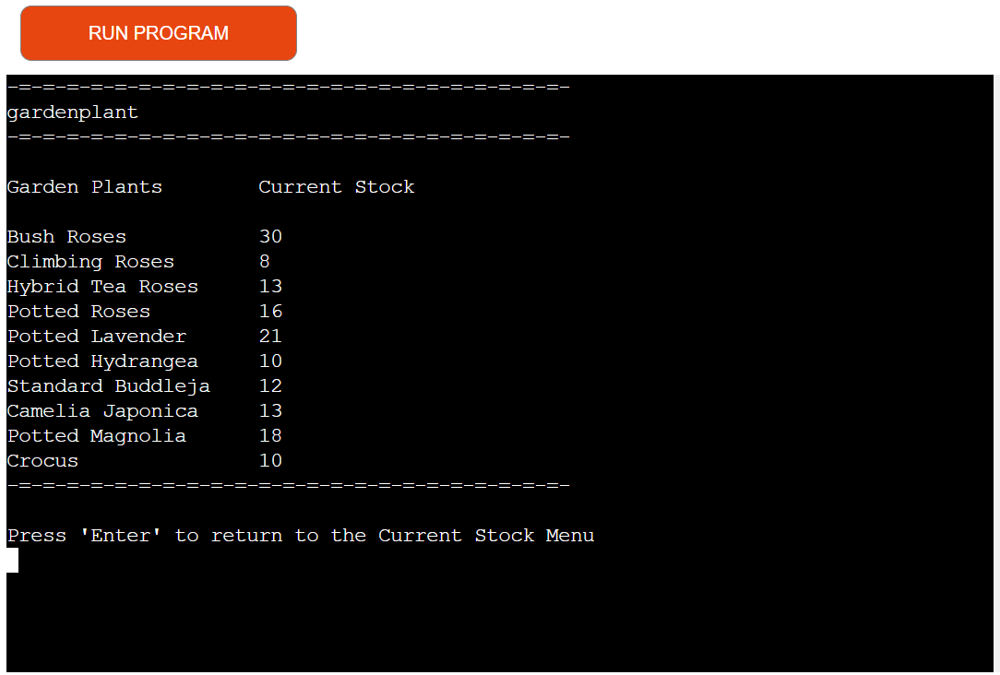

# Flowers for Life

Flowers for Life is a CLI data automation program designed for the inventory management of flowers in a florist shop. 

User can acknowledge current stock of flowers and accordingly add or deduct plants in or from the current stocks as sold, used or bought. User can additionally remove an existing plant in the current stock that is no more seasonal and instead input a new plant that is available during the season, in its respective category.

This python programme runs in the Code Institute mock terminal on Heroku.

Deployed application can be viewed here: [Flowers for Life]( https://flowers-for-life-409563cf12eb.herokuapp.com/)

  

# Table of content

[User Experience](#user-experience)

[Features](#features)

[Flow Chart](#flow-chart)

[Technology used](#technology-used)

[Python libraries used](#python-libraries-used)

[Testing](#testing)

[Bugs](#bugs)

[Unfixed Bugs](#unfixed-bugs)

[Deployment](#deployment)

[Credits](#credits)

# User experience

## Project Goals

The main purpose of Flowers for Life is to provide a timely stock management system for the plants in the florist business context. It combines various vital elements, including adding stock as bought, deducting stock as used in arrangements, sold individually or damaged, and updating the stock by adding new seasonal plants into their respective categories or deleting an existing plant name from the system that is out of season. 

## User stories

* As a user, I want to understand the main purpose of this program and its functionalities.

* As a user, I would like to easily navigate through the menu and sub-menus.

* As a user, I want to acknowledge my current stock and act accordingly.

* As a user, I want to add bought plants to my current stock into their respective categories. 

* As a user, I want to deduct plants from the current stock depending on the total sale of plants in each category.

* As a user, I want to update my current stock by adding newly bought seasonal plants into each category of the plants.

* As a user, I want to update my current stock by completely wiping out plants from any of the categories when they are seasonally not available at all.

* As a user, I would like to see all the changes made reflect on my Google Sheets.

* As a user, I would like my inputs to be validated whenever an error occurs.

# Features
All inputs have error messages that informs the user that their input is invalid and what they should enter.

### Welcome Screen
The welcome screen has been designed using ASCii art representing a garden of flowers and plants, and beneath it, the title of the application. ANSI Escape sequences have been used to add color to both features.

### Main Menu
Users are presented with a main menu displaying four different options:

1.	User can input option 1 and press Enter to access the View Current Stock
2.	User can input option 2 and press Enter to proceed to Add Stock 
3.	User can input option 3 and press Enter to proceed to Deduct Stock
4.	User can input option 4 and press Enter to access Update Stock sub-menu

   

**View Current Stock**

After proceeding to the View Current Stock option, the user will be presented with a sub-menu options where:
1. The user can input 1 and press Enter to access the Flower sheet.
2. The user can input 2 and press Enter to access the Gardenplant sheet.
3. The user can input 1 and press Enter to access the Houseplants sheet.
6. Alternately, the user can opt to return to the Main Menu by inputting 4 and pressing Enter.

   
 

**View Current Stock in each category**

The Google sheets for the current stock of each category of plants features the plant’s name and its actual quantity held in stock. By pressing Enter, the user can go back to the sub-menu.

1. **Flowers** current stock.

2. **Gardenplant** current stock.

3. **Houseplants** current stock.

4.	**Return to Main Menu**.
This option will bring the user back to the main menu.

 

**Add Stock**

The Add Stock option will direct the user to the same sub-menu that features the three categories of plants and their current stock amount. Once the user enters a plant category, they can add more stock to any specific plant listed there.

 

If the user chooses ‘flowers’ from the sub-menu options and presses Enter, he or she will be asked to enter the flower name. If user types a relevant flower name from the current stock and presses Enter, he or she will then be asked to add the amount they wish to add and to press Enter. If all entries are successful, user will receive a confirmation message stating the amount added to that particular flower and how much is the new amount now in the current stock.   The same amount will also reflect on the flowers Google sheet. The procedure is the same for other chosen categories of plant too.

 

**Deduct Stock**

- The Deduct Stock option also displays the same sub-menu of plants categories.  

 

If the user selects houseplants category and presses Enter, he or she will be asked to Enter a relevant houseplant name from the current stock and to press Enter. Thereafter, the user will be asked to Enter the amount to be used and to press Enter. If the inputs pass, a confirmation message will appear stating how much of the entered houseplant has been withdrawn, and what is the new amount in the current stock now. This new amount will also reflect on the ‘houseplants’ Google sheet. The procedure is the same for other chosen categories of plant too.

 

**Update Plants**

The Update Stock option will direct the user to another sub-menu that will feature:
1.	**View Plants List**

Upon choosing this option, user will be directed to the plants lists sub-menu where they can choose which plant list they want to view and upon pressing Enter, they will be directed to the particular list.

**Plants Lists interacting with Google Sheet**

Each plant list contains a variety of plants’ list for every season and it is a reference for the user where he or she can order as many seasonal plants as they wish from any plants’ category. 

       
	
   
	

	
2.	**Add New Plant**

With reference to the plants’ list, the user can add as many newly bought plants into the current stock with the new amount entered. After choosing Add New Plant and pressing Enter, the user will be directed to a sub-menu featuring the plants’ categories. The user selects which category of plant they wish to add the new plants to and presses Enter. As per the category chosen, user will be asked to enter flower, gardenplant or houseplants name. After entering the name, they will be asked to enter the amount to be added. If all entries are passed, a confirmation message will appear showing 

3.	**Remove Existing Plant**

After choosing Remove Existing Plant and pressing Enter, the user will be directed to the same sub-menu featuring the plants’ categories. The user will be asked the plant name they wish to remove from the existing category. After entering the particular plant name and pressing Enter, the user gets notified that the particular plant is deleted. User can continue to either delete more plants or exit to the sub-menu.

4.	**Return to Main Menu** - The User returns to the Main Menu with this option.

 

**Google Sheets**

The application interacts with Google Sheets to store and process data. Data is stored in a tabular format with the Current Stock rows updating in each plant category whenever the user is adding or deducting the plants’ stock. In regards to the Plants Lists, User can access the different plants' category lists to be able to refer to the seasonal plants and accordingly update the current stock. Besides that, the user has the option to delete a complete row of plant from the current stock whenever the plant is no more seasonal or not available.   

 

 

 

 

 

 

