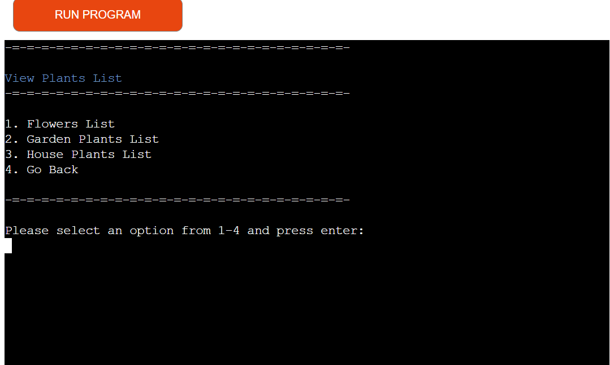

# Flowers for Life

Flowers for Life is a CLI data automation program designed for the inventory management of flowers in a florist shop. 

User can acknowledge current stock of flowers and accordingly add or deduct plants in or from the current stocks as sold, used or bought. User can additionally remove an existing plant in the current stock that is no more seasonal and instead input a new plant that is available during the season, in its respective category.

This python programme runs in the Code Institute mock terminal on Heroku.

Deployed application can be viewed here: [Flowers for Life]( https://flowers-for-life-409563cf12eb.herokuapp.com/)

  

# Table of content

[User Experience](#user-experience)

[Flow Chart](#flow-chart)

[Features](#features)

[Technology used](#technology-used)

[Python libraries used](#python-libraries-used)

[Testing](#testing)

[Bugs](#bugs)

[Unfixed Bugs](#unfixed-bugs)

[Deployment](#deployment)

[Credits](#credits)

# User experience

## Project Goals

The main purpose of Flowers for Life is to provide a timely stock management system for the plants in the florist business context. It combines various vital elements, including adding stock as bought, deducting stock as used in arrangements, sold individually or damaged, and updating the stock by adding new seasonal plants into their respective categories or deleting an existing plant name from the system that is out of season. 

## User stories

* As a user, I would like to easily navigate through the menu and sub-menus.

* As a user, I want to acknowledge my current stock and act accordingly.

* As a user, I want to add plants to my current stock into their respective categories. 

* As a user, I want to deduct plants from the current stock depending on the total sale of plants in each category.

* As a user, I want to update my current stock by adding newly bought seasonal plants into each category of the plants.

* As a user, I want to update my current stock by completely wiping out plants from any of the categories when they are seasonally not available.

* As a user, I would like to see all the changes made reflect on my Google Sheets.

* As a user, I would like my inputs to be validated whenever an error occurs.

# Flowchart
Lucidchart was used to design the flowchart for this apllication.

  

# Features
All inputs have error messages that informs the user that their input is invalid and what they should enter.

### Welcome Screen
The welcome screen has been designed using ASCii art representing a garden of flowers and plants, and beneath it, the title of the application. ANSI Escape sequences have been used to add color to both features.

### Main Menu
Users are presented with a main menu displaying four different options:

1.	User can input option 1 and press Enter to access the View Current Stock
2.	User can input option 2 and press Enter to proceed to Add Stock 
3.	User can input option 3 and press Enter to proceed to Deduct Stock
4.	User can input option 4 and press Enter to access Update Stock sub-menu

   

**View Current Stock**

After proceeding to the View Current Stock option, the user will be presented with a sub-menu options where:
1. The user can input 1 and press Enter to access the Flower sheet.
2. The user can input 2 and press Enter to access the Gardenplant sheet.
3. The user can input 1 and press Enter to access the Houseplants sheet.
6. Alternately, the user can opt to return to the Main Menu by inputting 4 and pressing Enter.

   
 

**View Current Stock in each category**

The Google sheets for the current stock of each category of plants features the plant’s name and its actual quantity held in stock. By pressing Enter, the user can go back to the sub-menu.

1. **Flowers** current stock.

2. **Gardenplant** current stock.

3. **Houseplants** current stock.

4.	**Return to Main Menu**.
This option will bring the user back to the main menu.

 

**Add Stock**

The Add Stock option will direct the user to the same sub-menu that features the three categories of plants and their current stock amount. Once the user enters a plant category, they can add more stock to any specific plant listed there.

 

If the user chooses ‘flowers’ from the sub-menu options and presses Enter, he or she will be asked to enter the flower name. If user types a relevant flower name from the current stock and presses Enter, he or she will then be asked to add the amount they wish to add and to press Enter. If all entries are successful, user will receive a confirmation message stating the amount added to that particular flower and how much is the new amount now in the current stock.   The same amount will also reflect on the flowers Google sheet. The procedure is the same for other chosen categories of plant too.

 

**Deduct Stock**

- The Deduct Stock option also displays the same sub-menu of plants categories.  

 

If the user selects houseplants category and presses Enter, he or she will be asked to Enter a relevant houseplant name from the current stock and to press Enter. Thereafter, the user will be asked to Enter the amount to be used and to press Enter. If the inputs pass, a confirmation message will appear stating how much of the entered houseplant has been withdrawn, and what is the new amount in the current stock now. This new amount will also reflect on the ‘houseplants’ Google sheet. The procedure is the same for other chosen categories of plant too.

 

**Update Plants**

The Update Stock option will direct the user to another sub-menu that will feature:
1.	**View Plants List**

Upon choosing this option, user will be directed to the plants lists sub-menu where they can choose which plant list they want to view and upon pressing Enter, they will be directed to the particular list.

**Plants Lists interacting with Google Sheet**

Each plant list contains a variety of plants’ list for every season and it is a reference for the user where he or she can order as many seasonal plants as they wish from any plants’ category. 

       
	
   
	

	
2.	**Add New Plant**

With reference to the plants’ list, the user can add as many newly bought plants into the current stock with the new amount entered. After choosing Add New Plant and pressing Enter, the user will be directed to a sub-menu featuring the plants’ categories. The user selects which category of plant they wish to add the new plants to and presses Enter. As per the category chosen, user will be asked to enter flower, gardenplant or houseplants name. After entering the name, they will be asked to enter the amount to be added. If all entries are passed, a confirmation message will appear showing 

3.	**Remove Existing Plant**

After choosing Remove Existing Plant and pressing Enter, the user will be directed to the same sub-menu featuring the plants’ categories. The user will be asked the plant name they wish to remove from the existing category. After entering the particular plant name and pressing Enter, the user gets notified that the particular plant is deleted. User can continue to either delete more plants or exit to the sub-menu.

4.	**Return to Main Menu** - The User returns to the Main Menu with this option.

 

**Google Sheets**

The application interacts with Google Sheets to store and process data. Data is stored in a tabular format with the Current Stock rows updating in each plant category whenever the user is adding or deducting the plants’ stock. In regards to the Plants Lists, User can access the different plants' category lists to be able to refer to the seasonal plants and accordingly update the current stock. Besides that, the user has the option to delete a complete row of plant from the current stock whenever the plant is no more seasonal or not available.   

 

 

 

 

 

 

[Back to top ⇧](#flowers-for-life)

## Technologies Used

### Language Used

* [Python3](https://en.wikipedia.org/wiki/Python_(programming_language)) was used to write all the codes for this project.

### Frameworks, Libraries and Programs Used

* [GitPod](https://gitpod.io/) was used for writing the codes, committing, and then pushing to GitHub.

* [GitHub](https://github.com/) was used to store the project after pushing.

* [Heroku](https://id.heroku.com/) was used to deploy the application.

* [gspread](https://docs.gspread.org/en/v6.0.0/) played a key role in facilitating easy and intuitive interaction with the Google Sheets.

* [google.oauth2.service_account.Credentials](https://developers.google.com/identity/protocols/oauth2) part of the google-auth library, this module was used to securely authenticate the application by using a service account credentials stored in the JSON file. 

* [os](https://www.w3schools.com/python/module_os.asp) part of Python's standard library, the os module enabled interaction with the operating system for file operations, environment management, and running system commands.

* [PEP8 CI Python Linter](https://pep8ci.herokuapp.com/) was very useful in validating the Python codes. It featured all the errors clearly, thus rendering the debugging more easy.

* [ASCII Art Generator](https://www.asciiart.eu/) was used to design the welcome screen.

* [ASCII Art Banner Maker](https://manytools.org/hacker-tools/ascii-banner/) to create the banner in welcome screen.

* [ANSI Escape Code](https://en.wikipedia.org/wiki/ANSI_escape_code)  was used to apply color to the terminal texts. 

* [Lucidchart](https://lucid.co/) is a versatile tool that was used to plan and develop the project. It provides clear visualizations of the system architecture, workflows, database schemas, and user interactions. 

* [Google Sheets](https://www.google.com/sheets/about/) was vital in providing a versatile, accessible, and collaborative platform for managing the plant inventory data, facilitating seamless integration with my Python application to streamline operations and enhance productivity.

[Back to top ⇧](#flowers-for-life)

## TESTING

### Python PEP8 Validation
[Pep8 CI Python Linter](https://pep8ci.herokuapp.com/) was used to validate the python codes for the apllication. Most common issues raised were as follows:
* **E501** Line too long.
   * This error was raised as a result of the lines of code exceeding the maximum line length of 79 characters. It was resolved by the assistance of ChatGPT that suggested to split the long strings into multiple concatenated strings using parentheses. This was fixed.
* **W293** Blank line contains white space.
   * This warning was fixed by removing the white spaces on blank lines.
* **E302** Expected two blank lines.
   * This was resolved by pressing Enter one more time before the functions.   
* **W291** Trailing whitespace.
   * This issue was fixed by removing the white space at the end of the lines in question.

After these issues were fixed, the results showed no errors found.

### Manual Testing

<table>
    <tr>
        <th>Feature</th>
        <th>Outcome</th>
        <th>Example</th>
        <th>Explanation</th>
        <th>Pass/Fail</th>
    </tr>
    <tr>
        <td rowspan=2><strong>Menu Format</strong></td>
        <td>Validates input for the main menu option which is a number from 1 to 4.</td>
        <td></td>
        <td>As shown in the example, an error message displays whenever the user's input is greater than number 4, is a string or is a series of special characters. Each time the input is incorrect, the user is notified that the entry is invalid and that a number between 1 to 4 should be entered.</td> 
        <td>Pass</td>
    </tr>
        <td>Validates input for sub menu options which is a number between 1 to 4.</td>
        <td></td>
        <td>Same as the main menu, an error message displays whenever the user's input is greater than number 4, is a string or is a series of special characters. Each time the input is incorrect, the user is notified that the entry is invalid and that a number between 1 to 4 should be entered.</td>
        <td>Pass</td>
    </tr>   
    <tr>
        <td rowspan=4><strong>Data Entry Values</strong></td>
        <td>'Add Stock' Option Validates a string input which in this case is the plant names found in the current stock. Also validates a number for the amount to be added.</td>
        <td></td>
        <td>As shown in the image, any other string input than the houseplant name in the current stock is throwing an error stating that the input is not found the plants category. Inputting a number for the first entry and a string for the second entry also warns of an error. Finally, inputting a plant name found in the current stock of houseplants category validates the entry.</td>
        <td>Pass</td>
    </tr>
        <td>Validates a string input which in this case is the plants' names found in the current stock. Also validates a number for the amount to be deducted.</td>
        <td></td>
        <td>Pass</td>
    </tr>
        <td>Validates a string input which in this case is the plants' names found in the update plants lists. Also validates a number for the amount to be added.</td>
        <td></td>
        <td>Pass</td>
    </tr>
        <td>Validates a string input which in this case is the plant names that exist in the current stock of any chosen plant category. Validates removal of plant's name and amount by confirming deletion of the input.</td>
        <td></td>
        <td>Pass</td>
    </tr>
    <tr>
        <td>Google Sheets automation</td>
        <td>Checks for automation of tasks such as data validation, updates, and .</td>
        <td></td>
        <td>Pass</td>
    </tr>
</table>

### Testing User Stories

As a user, I want to be able to:
* Easily navigate through the main menu and sub-menus and hence select an option.
* View screen contents clearly and understand the flow of the program.
* Understand the menus texts clearly to be able to input data correctly.
* Receive appropriate feedback for any wrong input to be able to enter the input correctly.
* View the current stock of plants and acknowledge the plants categories, plants names and their actual quantity.
* Add plants within the different categories and be able to see the updates in the respective google sheets.
* Deduct plants quantity after usage and be able to see the changes reflect on the respective google sheets.
* Get prompted for details and be provided with information on the requirements for valid input.
* Move on to the next detail only after putting a valid input.
* After inputting the details for confirmation or after acknowledging contents of the screen, the possibility to either do the action (add/deduct/remove plant/Add new plant) or to exit it.
* View established lists of different categories of plants and choose to pick one and add to the current stock subject to its category.
* Remove a plant completely from its category and check the outcome on the google sheets.
* Opt to return to the main menu in order to select a different option and perform a new task.

[Back to top](#flowers-for-life)

### Development Bugs

Manual testing was performed for each feature during the development phase. A few problems were found and resolved. The final outcome was that all features worked as intended as can be seen in the [features section](#features).

Issues encountered during development are:

* Scrolling and previous screen texts overlapping in the next screens. Initially I thought it might be an issue with missing clear screen function but I could not figure out what was causing this until I took tutor support whereby it was brought to my attention that the mock terminal where the app was deployed has a set height. Hence, I went on to remove the ASCII banner ‘Welcome to’ text from the welcome screen and I had to reduce my plants’ lists to make sure that there was no scrolling. After that, I manually tested the app again. The issue was resolved.
   

* When entering details for add new plant, the program checks if the plant name is in the relevant category of the plant’s list and that it is not repeated from the current stock. It was not validating the input, that is if roses were already in the current stock of the flower category, it would still add a new row of roses with the new amount entered and that could occur for a number of times. This issue was resolved by adding an if statement to check if the plant name in the current stock cell is similar to the plant names in the cell list, then an error message will pop up to alert the user. 
